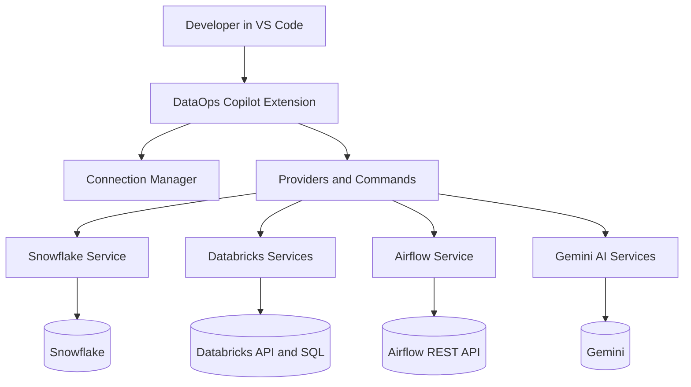
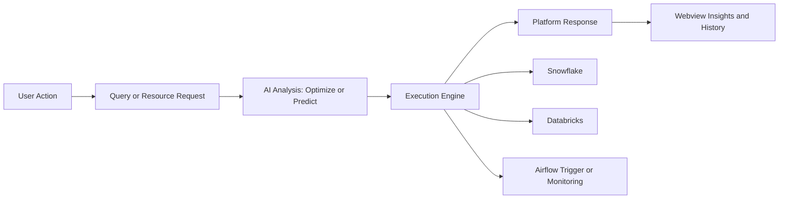

Forked from Nikhil Satysm's repo : https://github.com/Nikh9123/DataOps-Copilot
# 🚀 DataOps Copilot

> AI-powered DataOps Control Center for VS Code.


DataOps Copilot brings Snowflake, Databricks, and Airflow into one operational cockpit inside VS Code, then layers Gemini intelligence on top for optimization, observability, and decision support.

---

## 🖼️ Hero Section

Data teams do not need another isolated query runner. They need one control surface for execution, monitoring, orchestration, and AI-guided improvements.

DataOps Copilot is built for that exact workflow.

```text
┌──────────────────────────────────────────────────────────────┐
│  DataOps Copilot                                             │
│  Snowflake • Databricks • Airflow • Gemini                  │
│                                                              │
│  Execute SQL • Monitor Resources • Trigger DAGs • Optimize  │
└──────────────────────────────────────────────────────────────┘
```

> 💡 Tip
> Add one connection per platform and switch context from the status bar for a smooth multi-platform workflow.

---

## 🧠 What is DataOps Copilot?

DataOps Copilot is a production-grade VS Code extension designed for engineers who operate data platforms, not just write SQL.

It solves three common pain points:

- Tool fragmentation across Snowflake, Databricks, and Airflow.
- Lack of proactive insight before query/resource mistakes happen.
- Slow context switching between execution and observability.

Unlike standard platform-specific extensions, DataOps Copilot combines:

- Multi-platform control in one sidebar.
- AI-guided optimization and advisories.
- Operational actions (for example: trigger Airflow DAG runs) directly from context.

---

## ✨ Features

### AI SQL Intelligence

- AI Query Optimizer with actionable rewrites and replace-in-editor flow.
- AI Query Generator to convert natural language into SQL.
- Query Cost Predictor with rule-based analysis and optional AI augmentation.
- Structured output for issues, suggestions, and recommendations.

### Snowflake Integration

- Secure connection management.
- Metadata explorer: databases, schemas, tables.
- SQL execution from active editor.
- Table preview with rich result webview.
- Query history integration.

### Databricks Control Center

- Compute view with `SQL Warehouses`, `Clusters`, and `Apps`.
- Monitor clusters (state, workers, autoscale).
- Monitor jobs and run outcomes.
- Monitor SQL warehouses.
- List Databricks Apps from workspace APIs.
- Browse query history.
- Explore Unity Catalog metadata (catalogs, schemas, tables).
- Execute SQL statements with warehouse resolution.
- AI-backed resource advisor in details panel.

### Airflow Integration

- DAG monitoring with lazy loading.
- DAG run history.
- Task instance tracking (state, tries, duration).
- Trigger DAG execution directly from tree/context.
- DAG details panel with AI pipeline advisor.
- AI log analysis for DAG runs (error-focused when failures exist, summary-focused otherwise).
- Manual refresh workflow for user-controlled updates.

### Multi-platform Explorer

- One Connections view for Snowflake, Databricks, and Airflow.
- Global refresh and platform-specific refresh actions.
- User-controlled refresh flow (no forced Airflow auto-polling).
- Active connection indicator in status bar.
- Smooth command-palette driven workflows.

> 🔍 Highlight
> DataOps Copilot is an intelligence-first extension: it does not only execute commands, it helps you choose better actions before you run them.

---

## ⚔️ Comparison: Why It Wins

| Feature | Snowflake VS Code Extension | Databricks VS Code Extension | DataOps Copilot |
| --- | --- | --- | --- |
| Snowflake SQL execution | ✅ | ❌ | ✅ |
| Databricks SQL execution | ❌ | ✅ | ✅ |
| Airflow DAG monitoring + trigger | ❌ | ❌ | ✅ |
| Cross-platform connections in one view | ❌ | ❌ | ✅ |
| AI query optimization | Limited/No | Limited/No | ✅ |
| AI cost prediction | ❌ | ❌ | ✅ |
| AI resource advisor | ❌ | Limited | ✅ |
| Unified operational observability | ❌ | Partial | ✅ |
| Control-center style workflow | ❌ | ❌ | ✅ |

---

## 🧠 Why This Project is Different (USP)

### 1. Intelligence over pure execution

Most tools stop at "run command". DataOps Copilot adds analysis before and after execution.

### 2. AI-driven insights built into operations

Optimization, risk prediction, and advisory outcomes are part of the normal workflow, not an afterthought.

### 3. Observability + optimization in one loop

You can inspect platform health, run workload actions, and apply AI recommendations without leaving VS Code.

---

## 🏗️ Architecture Diagram



---

## 🔄 Data Flow Diagram



---

## 📂 Project Structure

```text
src/
  commands/
    addConnectionCommand.ts
    runQueryCommand.ts
    triggerDAGCommand.ts
    showAirflowDagDetailsCommand.ts
    showDatabricksDetailsCommand.ts
  providers/
    connectionsTreeDataProvider.ts
    databricksTreeProvider.ts
    airflowTreeProvider.ts
    historyTreeProvider.ts
  services/
    snowflakeService.ts
    databricksApiClient.ts
    databricksAppsService.ts
    databricksSqlService.ts
    databricksClusterService.ts
    databricksJobsService.ts
    databricksWarehouseService.ts
    databricksMetadataService.ts
    databricksQueryHistoryService.ts
    airflowService.ts
    aiProvider.ts
    aiOptimizerService.ts
    aiQueryGeneratorService.ts
    aiCostEstimatorService.ts
    geminiAdvisorService.ts
    geminiAirflowAdvisor.ts
  utils/
    webviewTableRenderer.ts
    airflowDagDetailsWebview.ts
    databricksDetailsWebview.ts
  models/
  extension.ts
resources/
  dataops.svg
```

---

## ⚙️ Installation and Setup

### 1. Clone

```bash
git clone https://github.com/Nikh9123/DataOps-Copilot.git
cd DataOps-Copilot
```

### 2. Install dependencies

```bash
npm install
```

### 3. Build

```bash
npm run compile
```

### 4. Launch extension host

- Open the project in VS Code.
- Press F5.

### 5. Create VSIX package (for direct use)

Build a distributable VS Code extension package:

```bash
npm run package:vsix
```

This creates a file named `dataops-copilot.vsix` in the project root.

### 6. Install extension from the VSIX file

Install directly from CLI:

```bash
npm run install:vsix
```

Or install from VS Code UI:

1. Open Extensions panel.
2. Click the `...` menu.
3. Select `Install from VSIX...`.
4. Choose `dataops-copilot.vsix`.

---

## 🔑 Configuration

Create a local `.env` file in project root.

### AI Provider

```env
DATAOPS_AI_PROVIDER=gemini
DATAOPS_GEMINI_API_KEY=YOUR_GEMINI_API_KEY
DATAOPS_GEMINI_MODEL=gemini-3-flash-preview
```

Or:

```env
DATAOPS_AI_PROVIDER=openai
DATAOPS_OPENAI_API_KEY=YOUR_OPENAI_API_KEY
DATAOPS_OPENAI_MODEL=gpt-4o-mini
```

### Optional Cost Hints

```env
DATAOPS_LARGE_TABLES=FACT_ORDERS,EVENTS,RAW_CLICKSTREAM
```

### Runtime Connection Inputs (in command flow)

- Snowflake: account, username, password.
- Databricks: workspace host, username, PAT, optional warehouse ID.
- Airflow: host/url, auth mode (basic or bearer), credentials.

---

## 🚀 Usage Guide

### Run SQL

1. Set active connection to Snowflake or Databricks.
2. Open a `.sql` file.
3. Execute `DataOps: Run Active SQL Query` or press Ctrl+Enter.

### Optimize SQL

1. Select or open SQL text.
2. Run `DataOps: Optimize Query`.
3. Review suggestions and replace query when needed.

### Predict Cost

1. Open SQL query.
2. Run `DataOps: Predict Query Cost`.
3. Inspect cost level, risks, and recommendations.

### Monitor Databricks Resources

1. Expand Databricks connection in Connections view.
2. Open `Compute` for SQL Warehouses, Clusters, and Apps.
3. Open Jobs, Query History, and Catalogs.
4. Click resource nodes for detailed insight panels.

### Analyze Airflow DAG Logs with AI

1. Expand Airflow connection and open a DAG or DAG run.
2. Run `DataOps: Analyze DAG Failure with AI`.
3. If errors exist, review root cause, task-level errors, suggested fixes, and next steps.
4. If no errors, review concise run-log summary and validation steps.

### Refresh Data Manually

1. Use `DataOps: Refresh Connections` for full refresh.
2. Use `DataOps: Refresh Databricks Services` for Databricks-only refresh.
3. Use `DataOps: Refresh Airflow` for Airflow-only refresh.

### Trigger Airflow DAG

1. Expand Airflow connection.
2. Open DAG node context menu.
3. Run `DataOps: Trigger DAG` and confirm.

---

## 🧠 AI Features Explained

### Query Generator

- Converts natural-language prompts into executable SQL.
- Helps analysts move from intent to query faster.
- Works with the active data platform context.

### Query Optimizer

- Detects inefficient SQL patterns.
- Suggests safer and faster alternatives.
- Supports direct replace in editor.

### Cost Predictor

- Combines heuristics and optional AI scoring.
- Flags high-risk patterns such as broad scans and unbounded queries.

### Resource Advisor

- Databricks advisor analyzes cluster/job/warehouse/app signals.
- Summarizes app health (running/stopped/failed) and possible failure reasons.
- Returns concise issues and optimization recommendations.

### Pipeline Advisor

- Airflow advisor analyzes DAG schedule, runs, and task behavior.
- Surfaces bottlenecks, reliability concerns, and practical next steps.

### DAG Log Analyzer

- Analyzes Airflow DAG task logs with AI.
- If failures exist, returns root cause, task-level errors, fixes, and next steps.
- If no failures exist, returns a concise execution summary and validation guidance.

---

## 📸 Screenshots

### Connections Explorer

Unified sidebar with Snowflake, Databricks, and Airflow connections, including Databricks compute grouping and Airflow DAG hierarchy.


### Query Optimizer

AI SQL optimization report showing detected issues, recommended fixes, and an optimized replacement query.


### Query Cost Predictor

Cost risk analysis panel with scan/cost level, issues, and execution suggestions before running SQL.


### Query Cost Warning Dialog

Pre-execution warning prompt that lets you review risks and choose whether to continue query execution.


### Query Results

Rich query result webview with metrics, AI warnings, and CSV export.


### Snowflake Table Preview

Table preview experience for Snowflake objects with result grid and performance hints.


### Databricks SQL and Catalog Experience

Databricks browsing and SQL/table preview workflow from the unified explorer.


### Databricks Warehouse Details with AI Insights

Warehouse state/capacity details with AI-generated issues, suggestions, and recommendation.


### Databricks Job AI Helper

Job run details panel with AI-assisted troubleshooting and optimization guidance.


### Databricks App AI Summary

App details panel with AI insights for app status (running/stopped/failed), possible failure reason, and practical improvement suggestions.


### Airflow DAG Details

DAG overview page with run history and task status visibility for operational debugging.


### Airflow DAG Tree View

Expanded DAG/run/task hierarchy from the connections explorer for quick operational navigation.


> 📌 Note
> Screenshots are stored in the `assets` folder and referenced directly in this README.

---

## 🛠️ Tech Stack

- TypeScript
- VS Code Extension API
- Snowflake SDK (`snowflake-sdk`)
- Databricks REST and SQL Statement APIs
- Apache Airflow REST API (`/api/v1`)
- Gemini / OpenAI provider abstraction
- Axios and dotenv

---

## 🔮 Future Enhancements

- Data lineage graph and dependency explorer.
- Unified cost dashboard across platforms.
- Auto-fix SQL mode with confidence scoring.
- Policy-aware governance checks before execution.
- Expanded observability timelines for runs/jobs/tasks.

---

## 🤝 Contributing

Contributions are welcome.

1. Fork the repository.
2. Create a feature branch.
3. Commit with clear messages.
4. Open a pull request with context and screenshots if UI changes are included.

Suggested local checks:

```bash
npm run compile
npm run lint
```

---

## 📜 License

MIT License.

---

## ⭐ Support This Project

If DataOps Copilot helps your team ship better data workflows:

- Star the repository.
- Share it with your data engineering team.
- Open issues for feature requests and platform integrations.

Built to make DataOps faster, smarter, and more reliable from inside your editor.
